# 天使桥 AngelBridge｜产品设计与协作方案

> **赛道**：软件应用赛道 · 命题「滴水穿石」
> **作品名称**：天使桥 AngelBridge
> **Slogan**：做彼此的天使 —— 凡人托举彼此的地方
> **一句话描述**：一个 AI 原生的「人生价值置换」平台。每个人把自己**拥有的**和**需要的**挂在一棵会成长的"人生树"上，AI 灵宠「小天」像贴身经纪人一样，替主人在人海中寻找价值互补的人与资源，让普通人之间互相托举。
> **命题呼应**：「滴水穿石」—— 人生树的成长分靠一次次微小的价值置换一点点积累，水滴石穿；平台上每一次凡人间的互助，都是穿石的一滴水。

**仓库现状说明**：`main` / `UI` 分支目前只有 README 和 .gitignore（团队基线，未开始编码）。本文档即为团队对齐基线，建议以 PR 合入 `main` 的 `docs/` 目录，达成共识后按本文分工开工。

---

## 目录

1. [产品全景与 MVP 范围](#1-产品全景与-mvp-范围)
2. [核心业务主流程](#2-核心业务主流程)
3. [逐页面组件与交互逻辑分析](#3-逐页面组件与交互逻辑分析)
4. [AI 设计：匹配引擎与灵宠小天](#4-ai-设计匹配引擎与灵宠小天)
5. [数据模型与种子数据](#5-数据模型与种子数据)
6. [API 契约](#6-api-契约)
7. [技术栈与目录结构](#7-技术栈与目录结构)
8. [前后端分工（4 人）](#8-前后端分工4-人)
9. [48 小时排期与协作规范](#9-48-小时排期与协作规范)
10. [演示剧本与提交清单核对](#10-演示剧本与提交清单核对)

---

## 1. 产品全景与 MVP 范围

### 1.1 产品全景思维导图

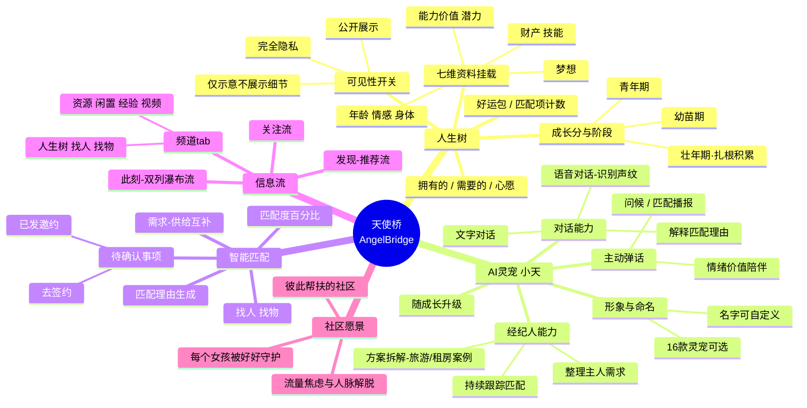

### 1.2 MVP 三层取舍（48 小时）

| 层级 | 含义 | 功能 |
|---|---|---|
| ✅ **Must（真做）** | 完整实现、真数据真 AI | 人生树页（3 档静态树 + 资料挂载）、资料填写表单、AI 匹配引擎、此刻双列信息流（含匹配度标签）、卡片详情页、灵宠气泡 + 文字对话、底部导航 |
| 🎭 **Fake（假做/演示态）** | UI 存在，逻辑用占位或写死 | 灵宠 16 选 1（静态页，选谁都是同一逻辑）、去签约（点击 toast「已发起意向」）、消息页（展示与小天的对话记录即可）、我的页（半静态）、发现 tab（复用此刻数据换排序） |
| ⏳ **Later（不做，口头讲）** | 路演时作为规划展示 | 语音识别与声纹判断、树的生长动画、交易/签约闭环、好运包玩法、关注流、视频频道、灵宠随成长升级 |

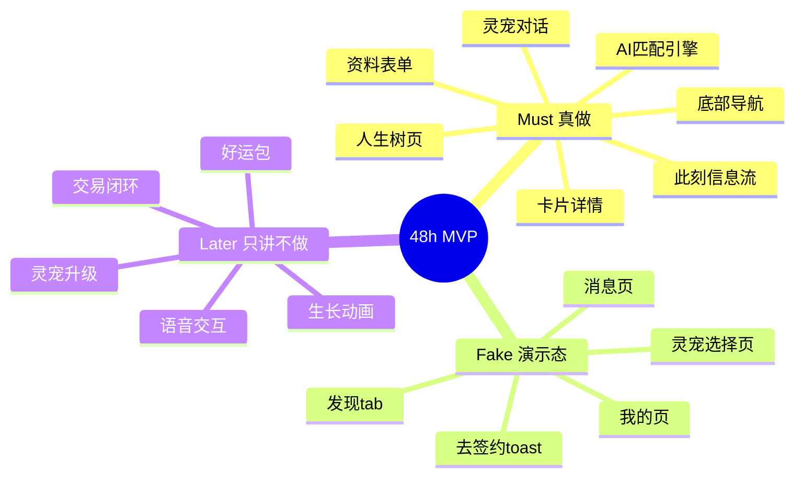

**取舍原则**：评审标准是「真正解决一个具体问题、可运行可体验」，不鼓励功能堆砌。所以把全部真实工作量押在一条链路上：**填人生树 → AI 匹配 → 信息流看到匹配 → 问灵宠为什么匹配**。这条链路每一步都必须是真的。

---

## 2. 核心业务主流程

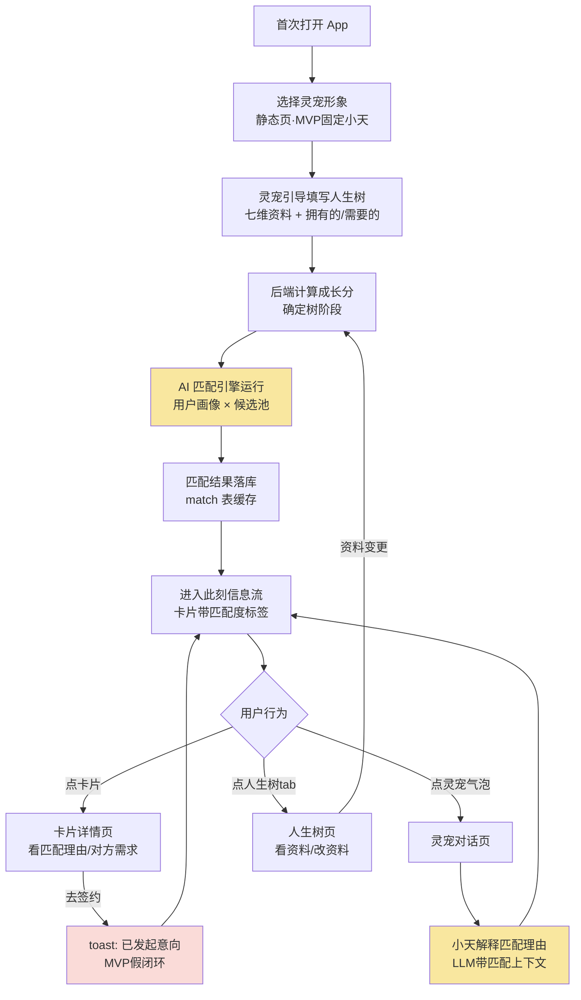

黄色 = AI 节点（Claude API）；红色 = 假闭环节点。

---

## 3. 逐页面组件与交互逻辑分析

### 3.0 全局框架：底部导航

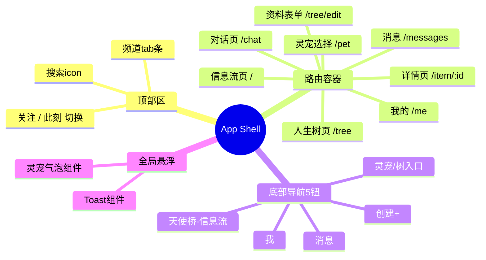

**导航逻辑**：底部 5 钮对应设计图（天使桥 / 消息 / ➕创建 / 灵宠 / 我）。「➕创建」MVP 弹一个「发布需求/资源」简化表单（直接写入 item 表），做不完就 toast「敬请期待」。

---

### 3.1 此刻信息流页（首页，A 负责）

#### 组件树

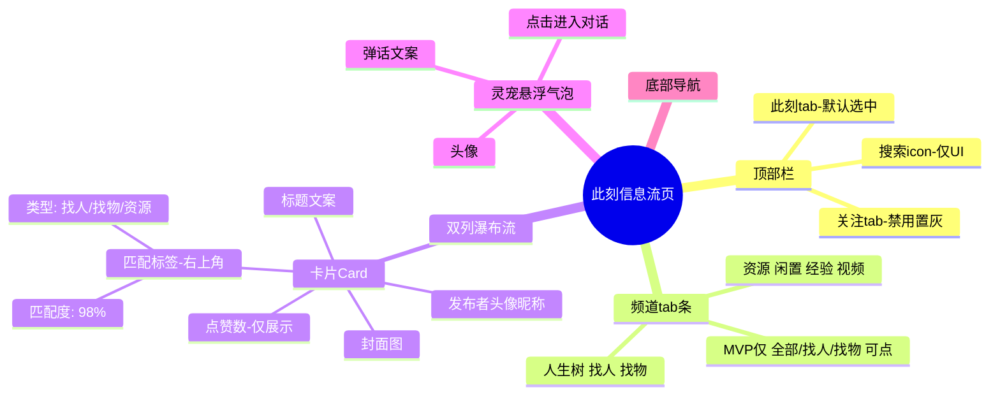

#### 交互流程

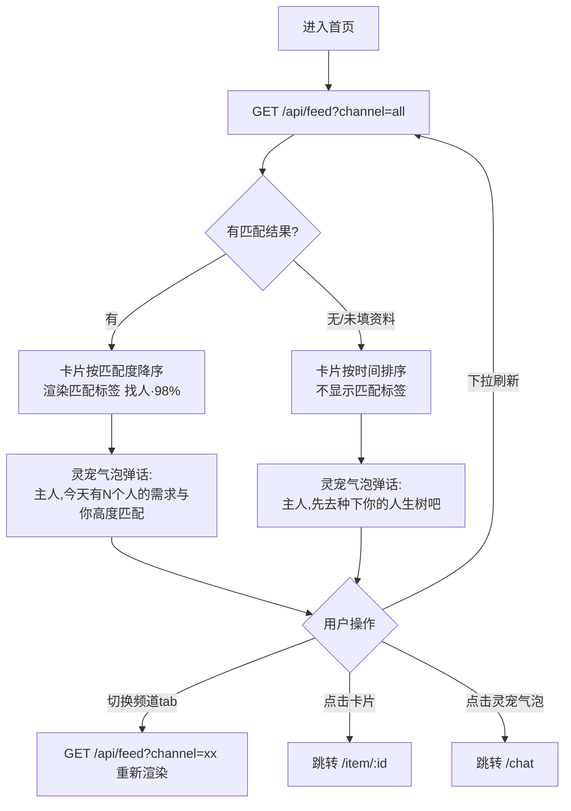

**组件要点**：
- 瀑布流用 CSS `columns: 2` 即可，不引重型库；
- 匹配标签是 demo 的视觉焦点，颜色按类型区分（找人=粉、找物=蓝、资源=绿），与设计图右上角标签一致；
- 「发现」tab 复用同一组件，接口传 `?mode=discover`（后端换个排序），成本≈0。

---

### 3.2 人生树页（B 负责）

#### 组件树

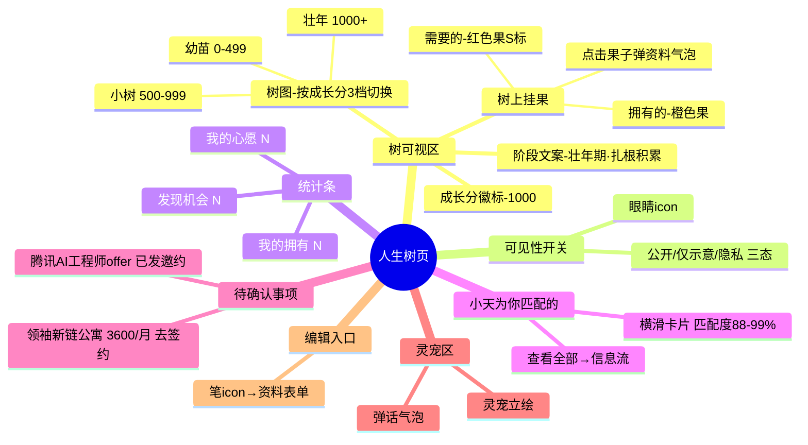

#### 交互流程

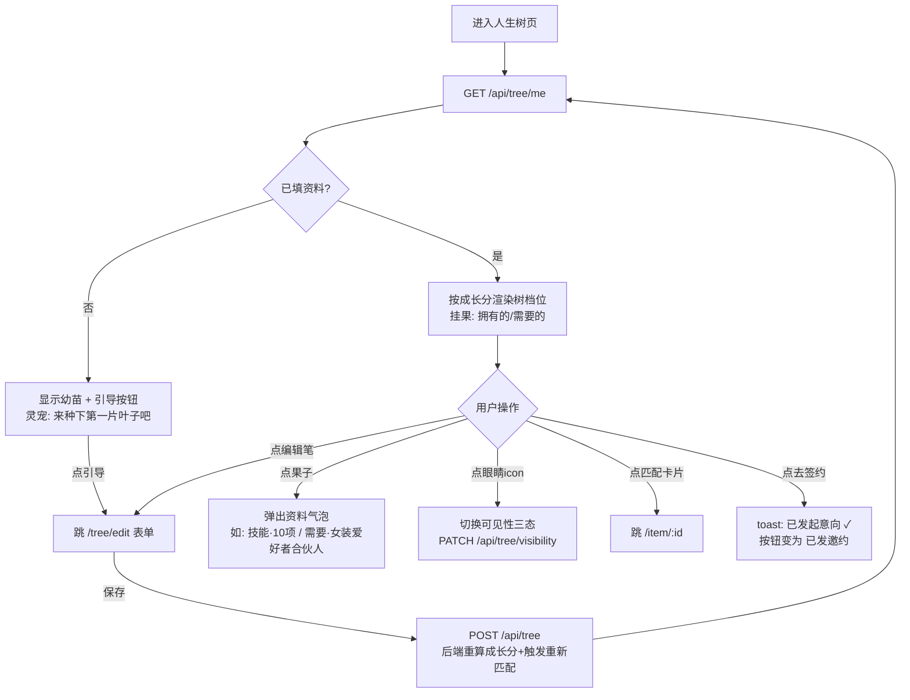

**成长分规则（MVP 简化，写死在后端）**：

```
成长分 = 资料完整度分(每维填写+100, 共7维) + 拥有项×30 + 需要项×20 + 心愿×50
档位:  0–499 幼苗 / 500–999 小树 / 1000+ 壮年·扎根积累
```

演示账号预填到 1000+，正好对应设计图「壮年期·扎根积累 成长分1000」。树的三档图由 D 用 AI 生图产出，**不做生长动画**，切档时加 0.3s 淡入即可有"进化感"。

---

### 3.3 资料编辑表单（B 负责）

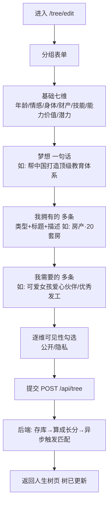

**要点**：表单是数据源头，字段名与 [第5节数据模型](#5-数据模型与种子数据) 完全一致，B 和 C 在第 2 小时对齐后冻结。每个字段旁的小锁 icon 对应设计图的"隐私模式"，MVP 只存标记、在他人视角隐藏该字段。

---

### 3.4 灵宠小天（B 前端 / C prompt）

#### 气泡弹话状态机

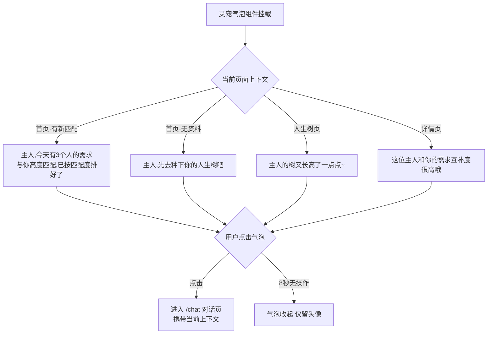

弹话文案 MVP **前端按页面上下文写死**（不走 LLM，省 token 省延迟），只有对话页走真 LLM。

#### 对话页流程（真 AI）

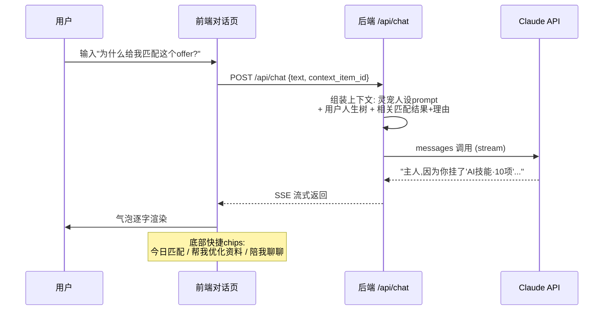

#### 灵宠选择页（Fake，静态）

16 宫格灵宠图（D 用 AI 生图批量产出，对应设计图的鼠/龙/虎/兔等），点击任意一只 → 存 `pet_avatar` 字段 → 进入引导。所有灵宠共用同一套逻辑与人设，仅头像不同——成本 1 小时，但演示时"选择你的守护灵宠"仪式感很强，值得保留。

---

### 3.5 卡片详情页（A 负责）

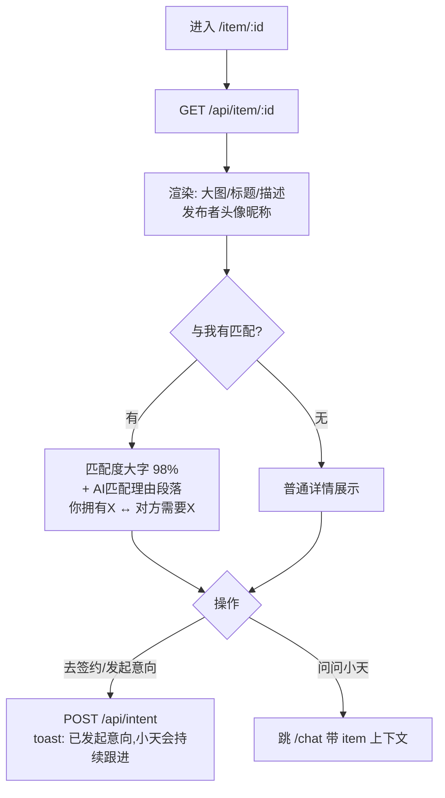

匹配理由段落是**评审最能感知 AI 价值的位置**，格式固定为「你拥有的 ___ ↔ 对方需要的 ___」对仗句式，由匹配引擎 JSON 直接给出。

---

### 3.6 消息页 & 我的页（Fake，A 顺手做）

- **消息页**：一个列表，仅两类会话——与小天的对话（点击进 /chat）、系统通知「你对 XX 发起了意向」。
- **我的页**：头像昵称 + 我的人生树入口 + 我发布的卡片列表。均为一屏静态布局 + 真数据填充，合计 ≤2 小时。

---

## 4. AI 设计：匹配引擎与灵宠小天

### 4.1 匹配引擎架构

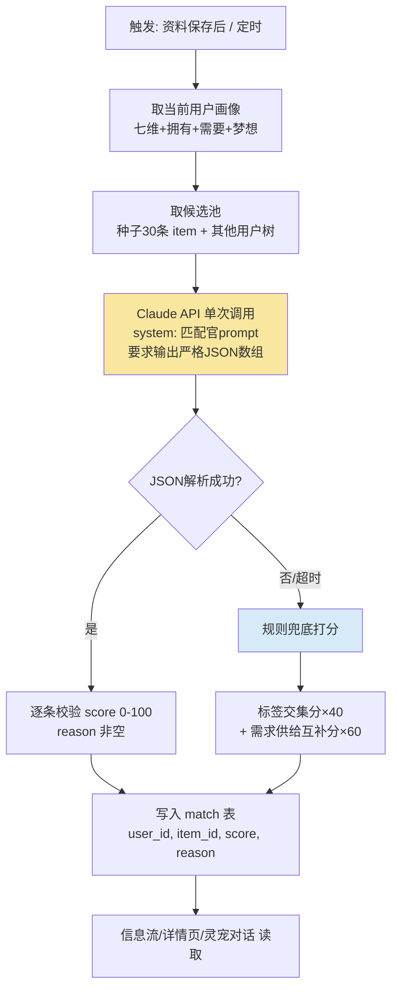

**匹配官 prompt 要点**（C 负责调优）：

```
你是"天使桥"的价值匹配官。给定【用户画像】和【候选列表】,
为每个候选打匹配分(0-100)并给一句匹配理由。
理由必须是对仗句式: "TA拥有的「X」正是你需要的「Y」"或反向。
只输出 JSON 数组: [{"item_id": "...", "score": 98, "reason": "..."}]
不允许输出任何其他文字。分数请拉开梯度,最高不超过99。
```

**兜底规则**（保证 demo 永远有匹配度数字）：

```
score = 40 × (双方标签交集数 / 标签并集数)
      + 60 × (我的"需要"命中对方"拥有"的条数 / 我的"需要"总数)
reason = 模板拼接: "TA拥有的「{命中项}」正是你需要的"
```

### 4.2 灵宠人设 prompt 要点（C 负责）

```
你是"小天",用户在天使桥的AI守护灵宠兼人生经纪人。
称呼用户为"主人"。语气温暖、俏皮、有情绪价值,每次回复≤80字。
你能看到: 主人的人生树资料、今日匹配结果与理由。
职责: ①播报和解释匹配 ②建议如何完善资料提高匹配 ③陪伴聊天。
不编造不存在的匹配;涉及交易只说"我会帮你持续跟进",不承诺结果。
```

### 4.3 Token 与稳定性预算

- 匹配调用：每用户 1 次/资料变更，候选池 30 条 ≈ 3k tokens，结果**落库缓存**，信息流读缓存不重复调用；
- 对话调用：流式输出，8s 超时则回退固定话术「主人，小天走神了，再说一次好吗？」；
- Demo 前预热：演示账号的匹配结果提前跑好存库，**现场断网也能展示信息流和匹配理由**（仅实时对话依赖网络）。

---

## 5. 数据模型与种子数据

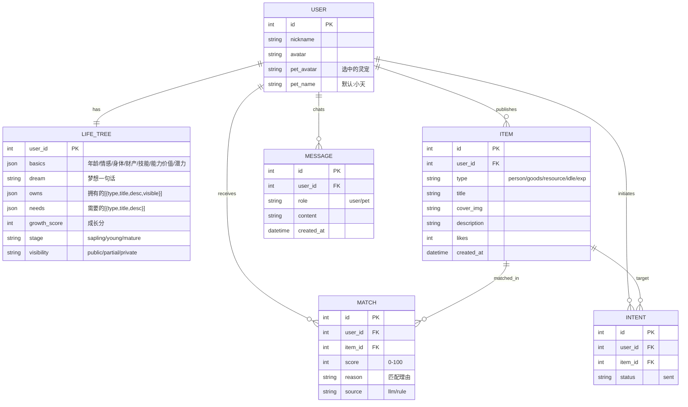

**种子数据策略（D 负责编写，第 8 小时前入库）**：30 条 item + 8 个虚拟用户树，内容直接采用设计图案例保证演示一致性——领袖新链公寓 3600/月、腾讯 AI 工程师 offer 53600/月、女装品牌合伙人、"一起打造实实爱情公寓"、"探讨情绪价值的产品"、奶茶新品体验等。演示主账号的"需要的"必须与其中 3–5 条强互补，保证匹配度能打到 90%+。

---

## 6. API 契约

Base URL：`/api`，全部 JSON。MVP 用固定演示账号，`Authorization: Bearer demo-token`（免注册登录流程，省 3 小时）。

| # | 方法 | 路径 | 用途 | 请求要点 | 响应要点 |
|---|---|---|---|---|---|
| 1 | GET | `/feed` | 信息流 | `?channel=all\|person\|goods&mode=now\|discover` | `[{item, match:{score,reason}\|null}]` |
| 2 | GET | `/item/:id` | 卡片详情 | - | `{item, publisher, match}` |
| 3 | GET | `/tree/me` | 我的人生树 | - | `{basics, dream, owns, needs, growth_score, stage, stats}` |
| 4 | POST | `/tree` | 保存资料 | 表单全量 JSON | `{growth_score, stage}` 并异步触发匹配 |
| 5 | PATCH | `/tree/visibility` | 可见性 | `{visibility}` | `{ok}` |
| 6 | GET | `/matches` | 匹配列表 | `?limit=10` | `[{item, score, reason}]` |
| 7 | POST | `/chat` | 灵宠对话 | `{text, context_item_id?}` | SSE 流式文本 |
| 8 | POST | `/intent` | 发起意向 | `{item_id}` | `{ok, status:"sent"}` |
| 9 | POST | `/item` | 发布卡片(创建+) | `{type,title,description}` | `{id}` |

**契约冻结机制**：第 2 小时由 A+C 在 `docs/api.md` 写下每个接口的完整 JSON 示例并 merge 到 main，**冻结**。前端立即据此写 `web/src/mocks/` 假数据开发；C 实现真接口后前端一行切换 baseURL 联调。改契约必须四人同步。

---

## 7. 技术栈与目录结构

| 层 | 选型 | 理由 |
|---|---|---|
| 前端 | React 18 + Vite + Tailwind CSS + react-router | 移动端 H5，手机浏览器演示，免 App 审核与打包 |
| 后端 | Node.js + Hono/Express + better-sqlite3 | 单文件数据库零运维，48h 最稳 |
| AI | Claude API（匹配引擎 + 灵宠对话，流式） | JSON 输出稳定，中文人设自然 |
| 部署 | 一台云主机 (Caddy 反代) ；备选 Vercel 前端 + 云主机后端 | 手机扫码直达，满足"可体验链接" |

**Monorepo 目录（建在现有仓库上）**：

```
AngelBridge/
├── README.md
├── docs/
│   ├── design.md        ← 本文档
│   ├── api.md           ← 接口契约（第2小时冻结）
│   └── submit.md        ← 提交材料汇总
├── web/                 ← 前端 (A 主导, B 共建)
│   ├── src/pages/       ← feed / tree / item / chat / edit / pet / me / messages
│   ├── src/components/  ← Card, PetBubble, TreeView, TabBar, Toast...
│   ├── src/mocks/       ← 契约假数据（联调前用）
│   └── src/api.ts       ← 统一请求层（切 mock/真实一行搞定）
├── server/              ← 后端 (C)
│   ├── src/routes/      ← feed / tree / chat / match / intent
│   ├── src/ai/          ← prompts.ts, matcher.ts, fallback.ts
│   └── seed/seed.json   ← 种子数据 (D 编写, C 入库)
└── assets/              ← D 的产出: 树3档图/16灵宠图/卡片配图
```

---

## 8. 前后端分工（4 人）

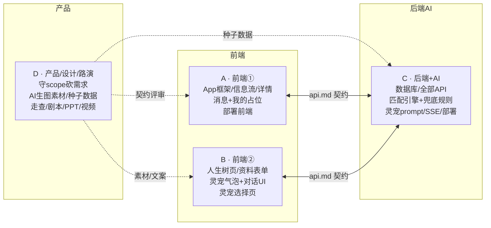

| 人 | 模块归属（对应第3节页面） | 关键交付节点 |
|---|---|---|
| **A 前端①** | 3.0 框架导航、3.1 信息流、3.5 详情页、3.6 消息/我的、前端部署 | 8h: mock 版信息流可点；24h: 真数据联调完 |
| **B 前端②** | 3.2 人生树、3.3 表单、3.4 灵宠全套 UI | 8h: 表单+树静态版；24h: 对话接通 SSE |
| **C 后端+AI** | 第 4/5/6 节全部、服务器部署 | 2h: 契约冻结；8h: CRUD 通；16h: 匹配引擎出 JSON；24h: 对话 SSE 通 |
| **D 产品** | 第 1 节 scope 裁决权、assets 素材、seed.json、第 10 节全部 | 8h: 素材+种子数据初稿；34h: 剧本彩排；42h: 备用视频+PPT |

**边界约定**：
- A 与 B 各自 own 页面目录互不交叉，共享组件（TabBar/Toast/PetBubble）由先用到的人建、放 `components/`；
- 灵宠是唯一跨界模块：**B 管 UI 与气泡文案，C 管对话后端与人设 prompt**，接口就是 `/chat` SSE；
- D 不写业务代码，但有**一票砍需求权**——任何模块在计划节点延误 >3h，D 决定降级为 Fake 层。

---

## 9. 48 小时排期与协作规范

### 9.1 甘特排期

```mermaid
gantt
    dateFormat HH
    axisFormat %H时
    title 48小时排期（0点=开赛）
    section 共同
    对齐范围+冻结API契约+建目录 :crit, m0, 00, 2h
    全链路联调           :crit, m1, 16, 4h
    功能冻结后只修bug     :crit, m2, 34, 14h
    section A 前端①
    脚手架+导航+信息流mock版 :a1, 02, 6h
    详情页+消息我的占位      :a2, 08, 8h
    信息流真数据+打磨       :a3, 20, 10h
    section B 前端②
    表单+人生树静态版      :b1, 02, 6h
    灵宠气泡+对话页UI      :b2, 08, 8h
    对话SSE联调+树切档打磨  :b3, 20, 10h
    section C 后端AI
    建库+CRUD+跑通Claude   :c1, 02, 6h
    匹配引擎+兜底规则      :c2, 08, 8h
    灵宠对话SSE+缓存+部署   :c3, 20, 12h
    section D 产品
    AI生图素材+种子数据    :d1, 02, 6h
    数据入库验收+prompt文案 :d2, 08, 8h
    走查清单+演示剧本      :d3, 20, 10h
    彩排+备用视频+PPT      :d4, 34, 10h
```

### 9.2 Git 协作规范（基于仓库现状）

仓库 README 已约定「PR 合入 main」，落地为：

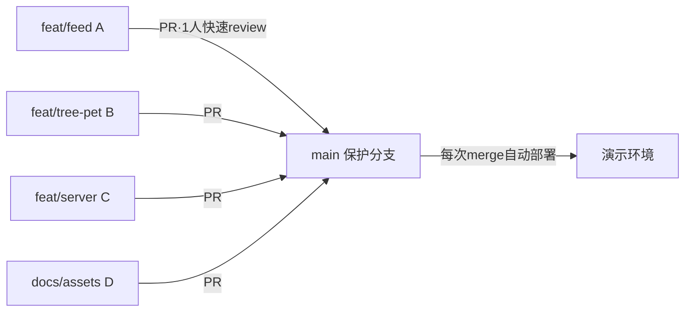

- **分支**：`feat/<模块>-<人>`，小步提交，**每 3–4 小时必须合一次 main**，严禁憋大 PR（48h 内合并冲突是头号杀手）；
- **Review**：hackathon 模式——PR 发群里 @ 一人，10 分钟内扫一眼即 merge，不追求完美；
- **main 永远可运行**：merge 前本地跑通再提；
- **同步节奏**：每 6 小时 10 分钟站会（0/6/12/18/24/30/36/42h），只说三句：做完了什么、接下来做什么、卡在哪；卡点超过 30 分钟必须喊人，不许闷头死磕；
- **敏感信息**：Claude API Key 只放服务器 `.env`（.gitignore 已覆盖），前端一律不碰 Key，所有 AI 调用走后端——同时满足赛事"数据安全"要求；
- **提交赛事 Tag**：终版 merge 后 `git tag "#shenicest-fission" && git push origin --tags`（若平台拒绝 `#` 开头 tag 名，用 `shenicest-fission`）。

### 9.3 三条铁律

1. **第 2 小时契约冻结、第 16 小时开始联调**，任何人不得以"我再优化下"推迟；
2. **34 小时功能冻结**，之后只修 bug、只打磨演示路径上的页面；
3. **42 小时前录好备用演示视频**——现场断网/服务挂掉时用视频路演。

---

## 10. 演示剧本与提交清单核对

### 10.1 两分钟演示剧本

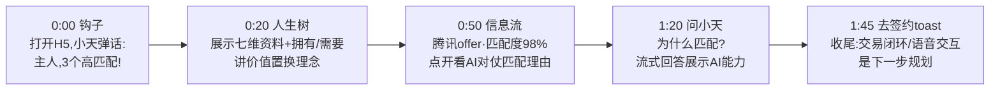

### 10.2 提交清单核对表（D 负责在 `docs/submit.md` 汇总）

| 提交项 | 内容 | 来源 |
|---|---|---|
| 赛道及命题 | 软件应用赛道 · 滴水穿石 | 本文档头部 |
| 作品名称 | 天使桥 AngelBridge | ✅ |
| Slogan | 做彼此的天使——凡人托举彼此的地方 | ✅ |
| 作品描述 | 本文档"一句话描述"扩写 200 字 | D 撰写 |
| 项目图片 | 4 张关键页截图 + 1 张架构图 | D 42h 前截取 |
| GitHub 仓库 + Tag | 本仓库，tag `#shenicest-fission` | 9.2 节流程 |
| 项目文档 | 本文档 + 开发过程记录（背景/用户/技术栈/创新点/分工/后续计划均已覆盖） | `docs/` |
| 演示视频 | 备用演示视频精剪 2–3 分钟 | D 42h 产出 |
| 体验链接（可选） | 云主机 H5 链接 + 二维码 | C 部署 |

**创新点论证（写入项目文档，呼应"AI 原生/Agent 协同"导向）**：
1. **AI 原生的匹配范式**——不是"用户搜索"，而是 Agent 主动理解人生画像做双向价值撮合，匹配理由可解释（对仗句式直给"你拥有↔TA需要"）；
2. **灵宠即 Agent 的人格化界面**——把冷冰冰的推荐系统变成有情绪价值的"人生经纪人"，播报、解释、跟进一体；
3. **滴水穿石的成长机制**——人生树成长分把"完善自我画像/参与互助"游戏化为可见的积累，驱动数据飞轮。

---

*本文档为团队对齐基线，建议以 PR 合入 `docs/design.md`。有异议在 PR 内评论，第 0–2 小时对齐会上裁决。*
